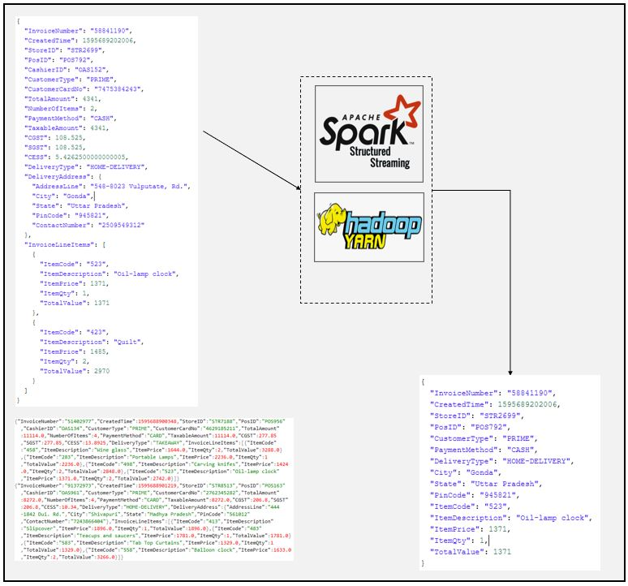

# SparkStream Json File Transform Example
### Dataflow Pipeline


### Summary

This is file source example for spark streaming. In this application hundereds of json data line by line structed in 3 seperate files. Spark applications read 1 data at each micro batches and transform data. Each json line has either 1 or more than 1 products informations. Each product informations will be extracted and saved into seperate json structure using spark functions such as explode. Data locations are hdfs locations because in this applications spark runs on top of yarn resource negotiator.

### Task List

- [x] Copy input files to hdfs
```
hdfs dfs -copyFromLocal /home/enes/Applications/BD_Project_2/app2/Spark_Stream_File_Source/input /home/enes/Applications/input
```
- [x] Create output directory on the hdfs
```
hdfs dfs -mkdir /home/enes/Applications/output
```
- [x] Create spark session and initialize logger (You can use ".master("local[*])" instead of yarn if you are running Spark on standalone mode")
```
if __name__ == "__main__":
    spark = SparkSession \
        .builder \
        .appName("File Streaming") \
        .config("spark.streaming.stopGracefullyOnShutdown", "true") \
        .config("spark.sql.streaming.schemaInference", "true") \
        .master("yarn") \
        .getOrCreate()

    logger = Log4j(spark)
```
- [x] Read data from file path, set option to process 1 file on each batch and define clean source condition as delete
```
## Read
## Reading json data from folder
    raw_df = spark.readStream \
            .format("json") \
            .option("path", "/home/enes/Applications/input") \
            .option("maxFilesPerTrigger", "1") \
            .option("cleanSource", "delete") \
            .load()
```
- [x] Flatten data and separate each products
```
## Transform
## Transform data
    explode_df = raw_df.selectExpr("InvoiceNumber", "CreatedTime", "StoreID", "PosID",
                      "CustomerType", "PaymentMethod", "DeliveryType",
                      "DeliveryAddress.City", "DeliveryAddress.State",
                      "DeliveryAddress.PinCode", "explode(InvoiceLineItems) as LineItem")

    #explode_df.printSchema()

    flattened_df = explode_df \
                    .withColumn("ItemCode", expr("LineItem.ItemCode")) \
                    .withColumn("ItemDescription", expr("LineItem.ItemDescription")) \
                    .withColumn("ItemPrice", expr("LineItem.ItemPrice")) \
                    .withColumn("ItemQty", expr("LineItem.ItemQty")) \
                    .withColumn("TotalValue", expr("LineItem.TotalValue")) \
                    .drop("LineItem")

```
- [x] Sink data to file source in output folder as json file
```
## Sink
## Move data to another folder
    invoice_writer_query = flattened_df.writeStream.format("json") \
            .option("path", "/home/enes/Applications/output") \
            .option("checkpointLocation", "Filestream/chk-point-dir") \
            .outputMode("append") \
            .queryName("Flattened Invoice Writer") \
            .trigger(processingTime="1 minute") \
            .start()

    logger.info("Flattened Invoice Writer started")
    invoice_writer_query.awaitTermination()
```

### Code Description

logger.py is logger class using log4j properties

filestream.py is spark script to make desired transformations. Note data data have a lot of json lines and spark itself smart enough to detect if current json line have 1 or more than 1 product (invoicelineitems)

### Running

1. Copy files to hdfs

2. Start spark job

3. Check results
